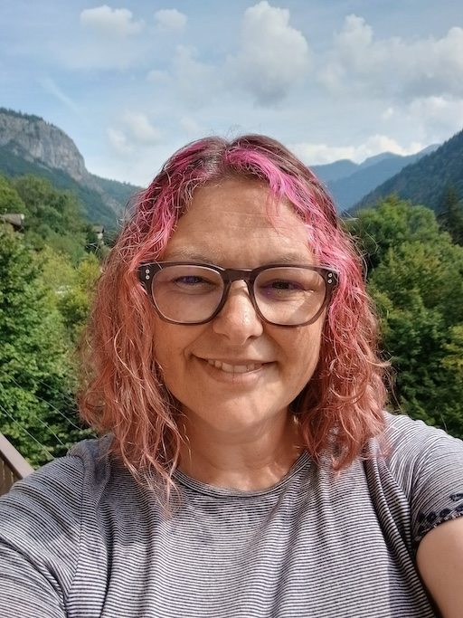

 
  [karenjex.blogspot.com](https://karenjex.blogspot.com/) 
  [www.linkedin.com/in/karenhjex](https://www.linkedin.com/in/karenhjex/)  
  Nationality: UK & French 
  Location: France

# Karen Hope Jex
## Senior Solutions Architect

Customer-focused database expert, recognised contributor to the [PostgreSQL project](https://www.postgresql.org/community/contributors/), member of the Board of [PostgreSQL Europe](postgresql.eu/), and Founder & Chair of its Diversity Committee.
With over 20 years of experience — starting in the Oracle ecosystem and transitioning into open source — I bring deep technical expertise and a passion for solving complex database challenges.

I actively support the PostgreSQL open source community through my leadership on the PostgreSQL Europe Board and by championing inclusion and accessibility as Chair of the Diversity Committee. I help clients get the most out of PostgreSQL through hands-on consulting, knowledge sharing, documentation development, and process optimisation.

A frequently invited [speaker](https://www.youtube.com/playlist?list=PL0IpRBoeAG2MrhwrFbDcu7W2LK9QN8dbE) at major PostgreSQL and developer conferences, I also lead trainings and mentor aspiring database professionals, helping others thrive in the open source space.

## Professional Experience

#### [Crunchy Data](https://www.crunchydata.com/) | Senior Solutions Architect | May 2022 - present Acquired by [Snowflake](https://www.snowflake.com/) June 2025

* Translate customers’ technical requirements into viable and scalable solution designs.
* Work closely with product teams to ensure Crunchy Data solutions meet customer requirements. 
* Accompany customers during upgrade, migration and other projects.
* Develop and deliver training workshops and conference talks, write technical blog posts.

#### [EnterpriseDB](https://www.enterprisedb.com/) | Senior Database Consultant | Jan 2020 – Apr 2022

* Delivered successful customer engagements for database system deployment, performance, security etc.
* Provided Technical Account Management for strategic customers.
* Wrote blog posts, presented webinars, spoke at conferences.
* Streamlined and standardised packaged customer services.

#### [Enedis](https://www.enedis.fr/) | Database Expert | May 2017 – Dec 2019	

* Provided database expertise on projects that managed the deployment of smart electricity meters.
* Managed and automated (via Ansible) Oracle and PostgreSQL database deployments.
* Provided database support and training for developers and other team members. 
* Implemented security rules and database upgrades, lead project to anonymize confidential data.

#### [QuintilesIMS (now IQVIA)](https://www.iqvia.com/) | Consultant Database Administrator | Jan 2010 to Dec 2016

* Lead the DBA efforts on an Oracle datawarehouse development project.
* Designed and implemented processes for data model and DDL change control and QA.
* Documented and implemented processes for day-to-day database activities.
* Managed projects and delegated tasks to junior team members.
* Managed and supported Oracle, SQL Server and Sybase database implementations.
* Enhanced and debugged PL/SQL code.
* Researched and tested Oracle new features and shared knowledge via documentation and training.

#### Previous Roles

2007 - 2010 Alpine Helpline (Owner) 
2001 – 2004 IMS Health (DBA) 
2000 – 2001 Axciom Ltd (DBA) 
1998 – 2000 Barnardos (Oracle DBA) 

### Qualifications

Oracle Certified Professional DBA (versions 7 to 12c) 
MSc Software Development (Distinction), Coventry University 
BSc (hons) Mathematics (Class I), University of Warwick 

### Volunteer Positions

#### [PostgreSQL Europe](https://www.postgresql.eu/) Board: Vice-Treasurer & Diversity Committee Lead (2024 - present)

I was elected to the PostgreSQL Europe board of directors in 2024, where I serve as vice-treasurer. During my term, I founded, and am leading, the [PostgreSQL Europe Diversity Committee](https://www.postgresql.eu/diversity/) to improve diversity within the PostgreSQL Europe community. I have documented both internal processes and guidelines for conference organisers, and I am working to make the work of the Board more transparent and to encourage participation from new PostgreSQL Europe community members.

#### [RightsTech Women, Geneva](https://rightstech.org/): Robotics/Coding Coach (2019 - present)

Volunteering as a coach for an organization that campaigns for women’s rights in STEM provides me with the opportunity to share my passion for technology and to encourage and mentor young women in a fun, supportive environment.

### Personal Projects

#### [Advent of Code](https://adventofcode.com/)
I participate in the Advent of Code challenge each year, mainly for fun, but also to keep my coding skills current and to help me learn new languages. I've used Python, Ruby, SQL and once even attempted it using bash scripts. My solutions are available at [github.com/karenjex/adventofcode](https://github.com/karenjex/adventofcode).

### Key Skills

* Database system problem solving, solution design and requirements analysis
* Verbal communication: customer engagements, training, conference talks 
* Written communication:  report writing, blog posts, presentations
* Database administration: performance tuning, data modelling, SQL
* Coding, DevOps, automation

### Key Tools and Technologies

#### Database

PostgreSQL, SQL, psql, pgAdmin, pgBackRest, PgBouncer, Patroni, PGO, Crunchy Postgres for Kubernetes (CPK), EDB Postgres, Postgres Enterprise Manager, repmgr

#### OS/Infrastructure

RHEL, CentOS, Ubuntu, Docker, Kubernetes, OpenShift, GKE, Rancher

#### Development/Automation

git, Ansible, Kustomize, Vagrant, Bash, Python, Ruby, Jira 

#### Previous

mRemote, Informatica, Spice, Weblogic, AIX, Oracle, SQL*Plus, PL/SQL, Oracle Developer, OEM

### Additional Information

Email: karenhjex@gmail.com  
Phone: +33 651774104  
Languages: English (first language),	French (fluent)